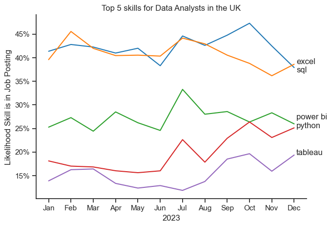

# Overview
This is my analysis of the data & tech job market, with a main focus on Data Analyst roles. Here i use market Data from 2023 in order to define top skills that are both well paid & in-demand. I hope to use this data to extrapolate to todays job market. However a repeat of this project on more up-to-date data would offer further valuable insights.

## Tools I used
For my deep dive into the data analyst job market, I harnessed the power of several key tools:

- Python: The backbone of my analysis, allowing me to analyze the data and find critical insights.I also used the following 
    - Python libraries:
    - Pandas Library: This was used to analyze the data.
    - Matplotlib Library: I visualized the data.
    - Seaborn Library: Helped me create more advanced visuals.
    - Jupyter Notebooks: The tool I used to run my Python scripts which let me easily include my notes and analysis.
- Visual Studio Code: My go-to for executing my Python scripts.
- Git & GitHub: Essential for version control and sharing my Python code and analysis, ensuring collaboration and project tracking.


#  The Analysis

## 1. What are the most in-demande skills for the top 3 data roles?
To identify the most in-demand skills for the top three most popular data roles, I first filtered the positions based on popularity. Then, I extracted the top five skills for each of these three roles. The query highlights the most sought-after job titles and their key skills, helping me determine which skills to focus on based on my target role.

View the notebook here:
[2_Skills_Count.ipynb](3_Project/2_Skills_Count.ipynb)

### Visualise Data

```python

fig, ax = plt.subplots(len(job_titles), 1)
sns.set_theme(style='ticks')

for i, job_title in enumerate(job_titles):
    df_plot = df_skills_percent[df_skills_percent['job_title_short'] == job_title].head(5)
    sns.barplot(data=df_plot, x='skill_percent', y='job_skills', ax=ax[i], hue='skill_count', palette='dark:b_r')
    ax[i].set_xlabel('')
    ax[i].set_ylabel('')
    ax[i].legend().set_visible(False)
    ax[i].set_title(job_title)
    ax[i].set_xlim(0, 75)
plt.show()

```
### Results


### Insights

#### Data Analyst

SQL leads at 43%, indicating it’s the most frequently mentioned skill for analysts.
Python is mentioned by 20% of postings—still relevant, but less emphasized than SQL for this role.

#### Data Engineer

SQL tops the list at 70%, underscoring its critical importance for engineering data pipelines and databases.
Python follows closely at 55%, highlighting that engineers also need strong programming skills alongside SQL.

#### Data Scientist

Python is the most mentioned skill (69%), showing its central role in machine learning, data manipulation, and analytics.
SQL ranks second at 44%, reflecting the need for data scientists to query and manage data efficiently, even though Python is more dominant.

#### Key Takeaways:

SQL is universally important across all three roles, but it’s especially critical for Data Engineers (70%).
Python is indispensable for Data Scientists (69%) and also highly valued for Data Engineers (55%).
For Data Analysts, SQL remains the primary skill, while Python, though useful, is less prominent than in the other two roles.


## 2. How are in-demand skills trending for Data Analysts?


### Visualise Data

```python
from matplotlib.ticker import PercentFormatter
ax = plt.gca()
ax.yaxis.set_major_formatter(PercentFormatter(decimals=0))

offsets = [-1, 0.05, 1, -0.05, 0.02]
for i in range (5):
    y_val = df_plot.iloc[-1, i] + offsets[i]
    plt.text(11.1, y_val, df_plot.columns[i])
plt.show()

```


### Results




### Insights

 - SQL & Excel remain both highly sought after skills throughout 2023.
 - SQL in-particular shows to be in decline towards the end of 2023.
 -Python shows a strong up-trend towards the end of 2023 along with Tableau.

 This offers an in-sight to where somebody trying to up-skill into the Data  Industry should focus their attention. 


## 3. How well do jobs and skills pay for Data Roles?

### Salary Analysis for Data Roles

### Visualise Data
``` python
sns.boxplot(data=df_uk_top6, x='salary_year_gbp', y='job_title_short',order=job_order)

plt.title('Salary Distribution in the UK')
plt.xlabel('Yearly Salary(£GBP)')
plt.ylabel('')
ax = plt.gca()
ax.xaxis.set_major_formatter(plt.FuncFormatter(lambda x, pos: f'£{int((x/1000))}K'))
plt.xlim(0, 250_000) 
plt.show()
```

### Results


*Box plot visualising the salary distribution for the top 6 Data Job Titles.*

### Insights
 
 #### Median Salarys:

 - Senior roles (Senior Data Scientist, Senior Data Engineer, Senior Data Analyst) have significantly higher median salaries than their non-senior counterparts.
 - Among non-senior roles, Data Scientists and Data Engineers have a higher median salary than Data Analysts.

 #### Salary Spread:
 - The Senior Data Scientist role has a large IQR, indicating a broad salary range within this position.
 - Data Engineers and Data Scientists also show a wide IQR, suggesting variability in pay, likely due to experience, company size, or industry.
 - The Data Analyst role has the narrowest IQR, meaning salaries are more consistent.

#### General Trend:
- There is a clear salary progression from junior to senior roles.
- Senior roles have more variation in salaries, likely due to experience, industry, and negotiation.


### Highest paid & most in-demand Data Analayst Skills

```python

fig, ax = plt.subplots(2, 1)
sns.set_theme(style='ticks')

# Top 10 Highest Paid Skills for Data Analysts
sns.barplot(data=df_da_top_pay_skills, x='median', y=df_da_top_pay_skills.index, ax=ax[0], hue='median', palette='dark:b_r', legend=False) #_r reverses coloring
ax[0].set_title('Top 10 Highest Paid Skills for Data Analysts')
ax[0].set_ylabel('')
ax[0].set_xlabel('')
ax[0].xaxis.set_major_formatter(plt.FuncFormatter(lambda x, pos: f'£{int(x/1000)}K'))

# Top 10 Most in-demand Skills for Data Analysts
sns.barplot(data=df_da_top_skills, x='median', y=df_da_top_skills.index, ax=ax[1], hue='median', palette='light:b', legend=False)
ax[1].set_title('Top 10 Most In-Demand Skills for Data Analysts')
ax[1].set_ylabel('')
ax[1].set_xlabel('Median Salary (GBP)')
ax[1].xaxis.set_major_formatter(plt.FuncFormatter(lambda x, pos: f'£{int(x/1000)}K'))
```

### Results


*Horizontal Bar chart. Upper chart represents highest paying skills. Lower chart shows most in-demand skills, ordered by highest paid*

### Insights
 
 #### Highest Paid Skills for Data Analysts (Top Chart)

 - The top-paying skills include Pandas, TensorFlow, NumPy, C++, PyTorch, and Aurora, indicating that machine learning, deep learning, and programming expertise lead to higher salaries.

 - Skills like MongoDB, MySQL, AWS, and Elasticsearch also rank high, showing that knowledge of data storage, retrieval, and cloud computing contributes to higher pay.

 - Most skills are related to Python, however C++ appears amonth the highest-paid, likely because of its use in high-performance computing and finance.

 #### Most In-Demand Skills for Data Analysts (Bottom Chart)

 - The most in-demand skills include Tableau, SQL, Looker, Python, and Power BI, showing that businesses highly value data visualization and querying expertise.

 - Traditional business tools like Excel and Outlook are still commonly required, emphasizing the importance of working within corporate environments.

 #### Key Takeaways

 Machine learning & AI expertise lead to higher salaries, but business intelligence and SQL skills are more in demand.
 

View the notebook here:
[4_Data_Roles_Salary_Analyists](3_Project/4_Data_Role_Salary_Analysis.ipynb)

## 4. The most optimal skills to learn for Data Analysts

This analysis looks into both the salary & the frequency that the skill appears in a job posting to show skills that both pay-well and are in-demand.

### Visualise Data
``` python
sns.scatterplot(
    data=df_plot,
    x='skill_percent',
    y='median_salary',
    hue='technology'
)

sns.despine()
sns.set_theme(style='ticks')

plt.xlabel('Percent of mentions in Data Analyst Job Postings ')
plt.ylabel('Median Salary (GBP)')
plt.title('Most Optimal Skills for Data Analysts in the UK')
plt.tight_layout()
```

### Results


### Insights

#### High Demand vs High Pay trade-off

- Skills like SQL, Python and Excel appear in many postings, but don’t necessarily offer the highest salary boost—because they’re so widely expected.
- Specialized or emerging tools (e.g., SQL Server, Flow, Looker) have fewer mentions but can correlate with higher salaries.

#### Programming & Analyst Tools
- Programming & Analyst tools seem to sit in a sweet spot of higher mention counts and very resonable salaries (although they do not demand the highest salary)


# What I Learned

Throughout this project i have developed my understanding of manipulating & visualising Data with python. 
I have used multiple different python libraries to process visualise data to gain valuable insights into the job market.
I have also become aware of how important data cleanup & preparation are when processing data.

# Conclusion

This project was not without it's difficulties but provided ample learning opportunities to work on repetition of data manipulation techniques. Learning how to use for & while loops to aggregate data was a particular challenge. I am also aware of how much there is yet to learn.

The insights I got enhance my understanding and provide actionable guidance for anyone looking to advance their career in data analytics. As the market continues to change, ongoing analysis will be essential to stay ahead in data analytics. This project is a good foundation for future explorations and underscores the importance of continuous learning and adaptation in the data field.

I plan to one day return to this project with a larger data set over multiple years to gain an idea of how to data & tech industry is evolving.
